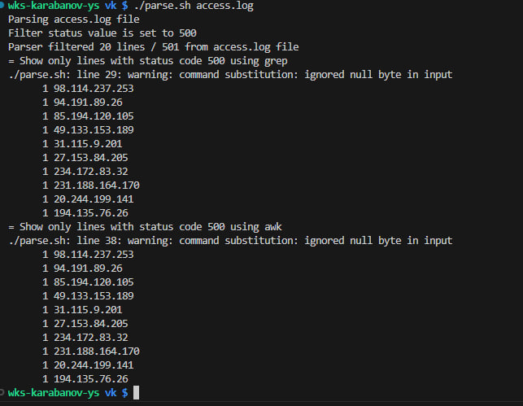

# Generate access.log
sample from task:
```
# SRC IP ; DEST IP ; HTTP CODE ; HTTP PATH ; RESP BYTES
# 10.2.3.4;192.168.10.10;500;/post?id=404;131
# 10.3.4.5;192.168.10.10;200;/healthz;12
# 10.4.5.6;192.168.10.11;504;/likes?post=404;132
# 10.5.6.7;192.168.10.11;201;/post/new;15
# <...>
```
random file generation:
```python
python3 gen_access.py
```
# Parse access.log and get result
Task: Необходимо написать программу на любом удобном языке, которая выведет 10 самых часто встречающихся SRC IP, которые получают статусы 500. Конечный список вывести в обратном порядке, от 10 места до 1ого.
```bash
./parse.sh access.log
```
Sample output



# One line decision
```bash
awk -v filter="500" -F ';' '$3 == filter { print $1 }' access.log | sort | uniq  | sort -nr | head -n 10
```